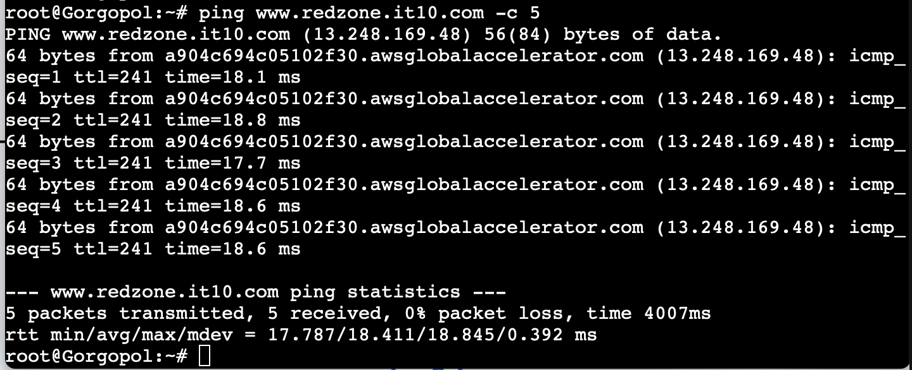

# Jarkom-Modul-2-IT10-2024


# Anggota Kelompok
| Nama | NRP |
| ---------------------- | ---------- |
| Khansa Adia Rahma      | 5027221071 |
| Gilang Raya Kurnaiwan   | 5027221045 |

Soal Jarkom Modul 2 2024

# 1. 
*Untuk membantu pertempuran di Erangel, kamu ditugaskan untuk membuat jaringan komputer yang akan digunakan sebagai alat komunikasi. Sesuaikan rancangan Topologi dengan rancangan dan pembagian yang berada di link yang telah disediakan, dengan ketentuan nodenya sebagai berikut :*
- *DNS Master akan diberi nama Pochinki, sesuai dengan kota tempat dibuatnya server tersebut*
- *Karena ada kemungkinan musuh akan mencoba menyerang Server Utama, maka buatlah DNS Slave Georgopol yang mengarah ke Pochinki*
- *Markas pusat juga meminta dibuatkan tiga Web Server yaitu Severny, Stalber, dan Lipovka. Sedangkan Mylta akan bertindak sebagai Load Balancer untuk server-server tersebut*

## Pengerjaan
1. Pertama membuat topologi seperti gambar berikut, dengan total *cloud NAT 1*, *Ethernet switch 2*, dan *ubuntu dengan image docker kuuhaku86/gns3-ubuntu:1.0.1 sebanyak 10*


2. Start terlebih dahulu untuk semua node. Lalu, akses web console pada *Erengel* dan pada ``nano/etc/network/interfaces``

Isikan dengan 

```
auto eth0
iface eth0 inet dhcp

auto eth1
iface eth1 inet static
  address 192.238.1.1
  netmask 255.255.255.0

auto eth2
iface eth2 inet static
  address 192.238.2.1
  netmask 255.255.255.0

auto eth3
iface eth3 inet static
  address 192.238.3.1
  netmask 255.255.255.0

auto eth4
iface eth4 inet static
  address 192.238.4.1
  netmask 255.255.255.0
```

Save dan exit

3. Lanjut ubah isi dari ``nano /etc/network/interfaces`` pada semua node dengan ketentuan berikut.

```
*Pochinki*
``auto eth0
iface eth0 inet static
    address 192.238.1.10
    netmask 255.255.255.0
    	gateway 192.238.1.1``

*Gorgopol*
auto eth0
iface eth0 inet static
    address 192.238.2.20
    netmask 255.255.255.0
    	gateway 192.238.2.1

*Severny*
auto eth0
iface eth0 inet static
    address 192.238.3.10
    netmask 255.255.255.0
    	gateway 192.238.3.1

*Stalber*
auto eth0
iface eth0 inet static
    address 192.238.3.30
    netmask 255.255.255.0
    	gateway 192.238.3.1
```

4. Selanjutnya, pada node *erengel* jalankan
``apt-get update`` dan ``apt install bind9``
jangan lupa untuk menjalankan 
``iptables -t nat -A POSTROUTING -o eth0 -j MASQUERADE -s 192.238.0.0/16``

tes jaringan dengan ``ping google.com``

# 2.
*Karena para pasukan membutuhkan koordinasi untuk mengambil airdrop, maka buatlah sebuah domain yang mengarah ke Stalber dengan alamat airdrop.xxxx.com dengan alias www.airdrop.xxxx.com dimana xxxx merupakan kode kelompok. Contoh : airdrop.it01.com*


## Pengerjaan
1. Pada node *Pochinki* jalankan
``echo nameserver 192.168.122.1 > /etc/resolv.conf`` selanjutnya, ``apt-get update`` dan ``apt install bind9 -y``

jika sudah berhasil, lanjut edit pada ``nano /etc/bind/named.conf.local``

isi kan dengan ini:

```
zone "airdrop.it10.com" {
	type master;
	file "/etc/bind/it10/airdrop.it10.com";
};
```


# 3 
*Para pasukan juga perlu mengetahui mana titik yang sedang di bombardir artileri, sehingga dibutuhkan domain lain yaitu redzone.xxxx.com dengan alias www.redzone.xxxx.com yang mengarah ke Severny*

## Pengerjaan
1. masih di node *pochinki* tambahkan pada ``nano /etc/bind/named.conf.local``

tambahkan dengan ini:

```
zone "redzone.it10.com" {
	type master;
	file "/etc/bind/it10/redzone.it10.com";
};
```

# 4. 
*Markas pusat meminta dibuatnya domain khusus untuk menaruh informasi persenjataan dan suplai yang tersebar. Informasi persenjataan dan suplai tersebut mengarah ke Mylta dan domain yang ingin digunakan adalah loot.xxxx.com dengan alias www.loot.xxxx.com*

## Pengerjaan
1. masih di node *pochinki* tambahkan pada ``nano /etc/bind/named.conf.local``

tambahkan dengan ini:

```
zone "loot.it10.com" {
	type master;
	file "/etc/bind/it10/loot.it10.com";
};
```

# 5. 
*Pastikan domain-domain tersebut dapat diakses oleh seluruh komputer (client) yang berada di Erangel*

## Pengerjaan
1. selanjutnya masih pada node *pochinki*. Buat direktori berikut ini ``mkdir /etc/bind/it10``

selanjutnya,
``cp /etc/bind/db.local /etc/bind/it10/airdrop.it10.com``
``cp /etc/bind/db.local /etc/bind/it10/redzone.it10.com``
``cp /etc/bind/db.local /etc/bind/it10/loot.it10.com``

jika sudah, 
- akses dan edit ``nano /etc/bind/it10/airdrop.it10.com`` menjadi seperti ini:

```
;
; BIND data file for local loopback interface
;
$TTL 604800
@   IN  SOA  airdrop.it10.com. root.airdrop.it10.com. (
                    	2022100601 	; Serial
                    	604800      	; Refresh
                    	86400       	; Retry
                    	2419200     	; Expire
                    	604800 )    	; Negative Cache TTL
;
@   	IN  NS  	airdrop.it10.com.
@   	IN  A   	192.238.3.30 ; IP Stalber
www 	IN  CNAME   airdrop.it10.com
@   	IN  AAAA	::1
```

- lanjut, akses dan edit ``nano /etc/bind/it10/redzone.it10.com``

menjadi seperti ini:

```
;
; BIND data file for local loopback interface
;
$TTL 604800
@   IN  SOA  redzone.it10.com. root.redzone.it10.com. (
                    	2022100601 	; Serial
                    	604800      	; Refresh
                    	86400       	; Retry
                    	2419200     	; Expire
                    	604800 )    	; Negative Cache TTL
;
@   	IN  NS  	redzone.it10.com.
@   	IN  A   	192.238.3.10 ; IP Severny
www 	IN  CNAME   redzone.it10.com.
@   	IN  AAAA	::1
```

- akses dan edit ``nano /etc/bind/it10/loot.it10.com`` menjadi seperti ini:

```
;
; BIND data file for local loopback interface
;
$TTL 604800
@   IN  SOA  loot.it10.com. root.loot.it10.com. (
                    	2022100601  ; Serial
                    	604800  	; Refresh
                    	86400   	; Retry
                    	2419200 	; Expire
                    	604800) 	; Negative Cache TTL
;
@   	IN  NS  loot.it10.com.
@   	IN  A   192.238.3.40 ; IP Mylta
www 	IN  CNAME   loot.it10.com.
@   	IN  AAAA	::1
```

jalankan: ``service bind9 restart``

2. untuk mengecek domain-domain pada nomor 2,3, dan 4 dapat diakses oleh semua client pada Erangel, maka:

pada node *pochinki* coba:
``ping airdop.it10.com -c 5``

selanjutnya, coba pada node *serverny*
jalankan berikut ini terlebih dahulu,
``echo nameserver 192.168.122.1 > /etc/resolv.conf``

``apt-get update``
``apt install bind9 -y``

``ping www.redzone.it10.com -c 5``


selanjutnya, coba pada node *georgopol*
jalankan berikut ini terlebih dahulu,
``echo nameserver 192.168.122.1 > /etc/resolv.conf``

``apt-get update``
``apt install bind9 -y``

``ping www.redzone.it10.com -c 5``



selanjutnya, coba pada node *mylta*
jalankan berikut ini terlebih dahulu,
``echo nameserver 192.168.122.1 > /etc/resolv.conf``

``apt-get update``
``apt install bind9 -y``

``ping www.loot.it10.com -c 5``


selanjutnya, coba pada node *Stalber*
jalankan berikut ini terlebih dahulu,
``echo nameserver 192.168.122.1 > /etc/resolv.conf``

``apt-get update``
``apt install bind9 -y``

``ping www.airdrop.it10.com -c 5``


begitu, jalankan dan coba pada semua client.


# 6. 
*Beberapa daerah memiliki keterbatasan yang menyebabkan hanya dapat mengakses domain secara langsung melalui alamat IP domain tersebut. Karena daerah tersebut tidak diketahui secara spesifik, pastikan semua komputer (client) dapat mengakses domain redzone.xxxx.com melalui alamat IP Severny (Notes : menggunakan pointer record)*

## Pengerjaan
1. pada node *pochinki* 
 edit, nano /etc/bind/named.conf.local

menjadi:
```
zone ".10.3.238.192.in-addr.arpa" {
	type master;
	file "/etc/bind/it10/10.3.238.192.in-addr.arpa";
};
```

``cp /etc/bind/db.local /etc/bind/it10/10.3.238.192.in-addr.arpa``

2. selanjutnya, edit juga pada 
```
zone ".10.3.238.192.in-addr.arpa" {
	type master;
	file "/etc/bind/it10/10.3.238.192.in-addr.arpa";
};
```

``cp /etc/bind/db.local /etc/bind/it10/10.3.238.192.in-addr.arpa``

3. dan lakukan 
``ping -t PTR IP 192.238.3.10``

# 7. 
*Akhir-akhir ini seringkali terjadi serangan siber ke DNS Server Utama, sebagai tindakan antisipasi kamu diperintahkan untuk membuat DNS Slave di Georgopol untuk semua domain yang sudah dibuat sebelumnya*

## Pengerjaan
1. pada node *pochinki*
edit ``nano /etc/bind/named.conf.local``

menjadi seperti di bawah ini:

```
zone "airdrop.it10.com" {
	type master;
also-notify { 192.238.2.20; }; 
    	allow-transfer { 192.238.2.20; };
	file "/etc/bind/it10/airdrop.it10.com";
};

zone "redzone.it10.com" {
	type master;
also-notify { 192.238.2.20; }; 
    	allow-transfer { 192.238.2.20; };
	file "/etc/bind/it10/redzone.it10.com";
};

zone "loot.it10.com" {
	type master;
also-notify { 192.238.2.20; }; 
    	allow-transfer { 192.238.2.20; };
	file "/etc/bind/it10/loot.it10.com";
};

zone "medkit.airdrop.it10.com" {
	type master;
also-notify { 192.238.2.20; }; 
    	allow-transfer { 192.238.2.20; };
	file "/etc/bind/it10/medkit.airdrop.it10.com";
};
```

2. jangan lupa untuk ``service bind9 restart``

3. Selanjutnya pada node *Georgopol*
edit pada ``nano /etc/bind/named.conf.local``

menjadi seperti ini:
```
zone "airdrop.it10.com" {
	type slave;
	masters { 192.238.1.10; }; 
	file "/var/lib/bind/airdrop.it10.com";
};
zone "redzone.it10.com" {
	type slave;
	masters { 192.238.1.10; }; 
	file "/var/lib/bind/redzone.it10.com";
};
zone "loot.it10.com" {
	type slave;
	masters { 192.238.1.10; }; 
	file "/var/lib/bind/loot.it10.com";
};

zone "medkit.airdrop.it10.com" {
	type slave;
	masters { 192.238.1.10; };
	file "/var/lib/bind/medkit.airdrop.it10.com";
};
```

4. masih pada node yang sama *georgopol*

tambahkan IP POCHINKI menjadi seperti berikut:

```
nameserver 192.168.122.1
nameserver 192.238.1.10 # IP Pochinki
```

jangan lupa untuk
``service bind9 restart``

5. cek berhasil
 pada node *pochinki* lakukan: ``service bind9 stop``
dan pada node *georgopol*: ping ke gorgopol misal airdrop.it10.com pada client Gorgopol. Jika ping berhasil maka konfigurasi DNS slave telah berhasil

# 8. 
*Kamu juga diperintahkan untuk membuat subdomain khusus melacak airdrop berisi peralatan medis dengan subdomain medkit.airdrop.xxxx.com yang mengarah ke Lipovka*

## Pengerjaan
1. pada node pochinki, kembali edit pada ``nano /etc/bind/it10/airdrop.it10.com``

menjadi seperti ini:

```
;
; BIND data file for local loopback interface
;
$TTL 604800
@   IN  SOA  airdrop.it10.com. root.airdrop.it10.com. (
                       		 2022100601 	; Serial
                       		 604800    	; Refresh
                       		 86400 	; Retry
                       		 2419200    	; Expire
                       		 604800)    	; Negative Cache TTL
;
@  	 IN  NS 	airdrop.it10.com.
@  	 IN  A  	 192.238.3.30 ; IP Stalber
www	IN CNAME	airdrop.it10.com
medkit IN A		192.238.3.20
@     	IN   AAAA  	::1
```

2. lakukan ``service bind9 restart``

3. ``ping medkit.airdrop.it10.com -c 5``

# 9. 
*Terkadang red zone yang pada umumnya di bombardir artileri akan dijatuhi bom oleh pesawat tempur. Untuk melindungi warga, kita diperlukan untuk membuat sistem peringatan air raid dan memasukkannya ke subdomain siren.redzone.xxxx.com dalam folder siren dan pastikan dapat diakses secara mudah dengan menambahkan alias www.siren.redzone.xxxx.com dan mendelegasikan subdomain tersebut ke Georgopol dengan alamat IP menuju radar di Severny*

## Pengerjaan
1. Pada node *Pochinki*
edit dan tambahkan pada  ``nano /etc/bind/it10/redzone.it10.com``

menjadi seperti ini:

```
;
; BIND data file for local loopback interface
;
$TTL 604800
@   IN  SOA  redzone.it10.com. root.redzone.it10.com. (
                       		 2022100601 	; Serial
                       		 604800    	; Refresh
                       		 86400 	; Retry
                       		 2419200    	; Expire
                       		 604800)    	; Negative Cache TTL
;
@  	 IN  NS 	redzone.it10.com.
@  	 IN  A  	192.238.3.10 ; IP Severny
www	IN CNAME	redzone.it10.com.
nsl	IN NS		192.238.3.10 ; IP Severny
siren	IN NS		ns1
@     	IN   AAAA  	::1
```

4. lakukan echo pada options seperti berikut:

```
echo "options {
	directory \"/var/cache/bind\";

	allow-query { any; };
	auth-nxdomain no;
	listen-on-v6 { any; };
};" > /etc/bind/named.conf.options
```

sehingga isi pada options menjadi seperti berikut ini:

```
options {
directory "/var/cache/bind";

allow-query { any; };
auth-nxdomain no;
listen-on-v6 { any; };
};
```

5. pada named.conf.local
modif dan edit menjadi:

```
zone "redzone.it10.com" {
	type master;
also-notify { 192.238.2.20; }; 
    	allow-transfer { 192.238.3.10; }; // Masukan IP Severny 
	file "/etc/bind/it10/redzone.it10.com";
};
```

6. jangan lupa untuk
``service bind9 restart``

7. selanjutnya pada node *georgopol*

```
echo "options {
	directory \"/var/cache/bind\";

	allow-query { any; };
	auth-nxdomain no;
	listen-on-v6 { any; };
};" > /etc/bind/named.conf.options
```

8. masih pada node *georgopol* edit 
`` nano /etc/bind/named.conf.local``
menjadi:

```
zone "siren.redzone.it10.com" {
	type master;
	file "/etc/bind/delegasi/siren.redzone.it10.com";
};
```

9. ``mkdir /etc/bind/delegasi``

``cp /etc/bind/db.local /etc/bind/delegasi/siren.redzone.it10.com``

``nano /etc/bind/delegasi/siren.redzone.it10.com``

dan edit menjadi:

```
; BIND data file for local loopback interface
;
$TTL 604800
@   IN  SOA  siren.redzone.it10.com. root.siren.redzone.it10.com. (
                    	2022100601 	; Serial
                    	604800      	; Refresh
                    	86400       	; Retry
                    	2419200     	; Expire
                    	604800 )    	; Negative Cache TTL
;
@   	IN  NS  	siren.redzone.it10.com.
@   	IN  A   	192.238.3.10 ; IP Severny
www 	IN  A   	192.238.3.10 ; IP Severny
```

10. jangan lupa untuk lakukan ``service bind9 restart``
11. pada node *mylta* coba lakukan ``ping www.siren.airdrop.it10.com``


# 10. 
*Markas juga meminta catatan kapan saja pesawat tempur tersebut menjatuhkan bom, maka buatlah subdomain baru di subdomain siren yaitu log.siren.redzone.xxxx.com serta aliasnya www.log.siren.redzone.xxxx.com yang juga mengarah ke Severny*

## Pengerjaan
1. modif node *gorgopol*
    ``nano /etc/bind/delegasi/siren.redzone.it10.com``

menjadi seperti ini:

```
;
; BIND data file for local loopback interface
;
$TTL 604800
@   IN  SOA  siren.redzone.it10.com. root.siren.redzone.it10.com. (
                	2022100601  	; Serial
                	604800      	; Refresh
                	86400       	; Retry
                	2419200     	; Expire
                	604800 )    	; Negative Cache TTL
;
@   	IN  NS  	siren.redzone.it10.com.
@   	IN  A   	192.238.3.10 ; IP Severny
www 	IN  A   	192.238.3.10 ; IP Severny
log 	IN  A   	192.238.3.10 ; IP Severny
www.log IN  A   	192.238.3.10 ; IP Severny
```

2. Coba di *mylta*
``ping log.siren.airdrop.it10.com``
``ping wwwlog.siren.airdrop.it10.com``


# 11. 
*Setelah pertempuran mereda, warga Erangel dapat kembali mengakses jaringan luar, tetapi hanya warga Pochinki saja yang dapat mengakses jaringan luar secara langsung. Buatlah konfigurasi agar warga Erangel yang berada diluar Pochinki dapat mengakses jaringan luar melalui DNS Server Pochinki*

## Pengerjaan
1. ``nano /etc/resolv.conf``  ganti ``192.168.122.1`` ke
``nameserver 192.238.1.10`` IP pochinki untuk semua node kecuali *erengel* dan *pochinki*


#PROBLEM

Untuk nomer 12 Masih ada kendala 

## 12. 
*Karena pusat ingin sebuah website yang ingin digunakan untuk memantau kondisi markas lainnya maka deploy lah webiste ini (cek resource yg lb) pada severny menggunakan apache*

### Pengerjaan
1.  Lakukan 

```
curl http:/192.238.3.10

nameserver 192.238.2.1
nameserver 192.238.3.10
nameserver 192.238.2.2
nameserver 192.238.2.3
nameserver 192.238.2.5
```

*MISC*

``ping google.com``
``iptables -t nat -A POSTROUTING -o eth0 -j MASQUERADE -s 192.238.0.0/16``

``ping -t A medkit.airdrop.it10.com``

```
nano .bashrc
echo nameserver 192.168.122.1 > /etc/resolv.conf *ke semua node pochinki erengel*
echo nameserver 192.238.1.10 > /etc/resolv.conf *ke selain node pochinki erengel*
```
